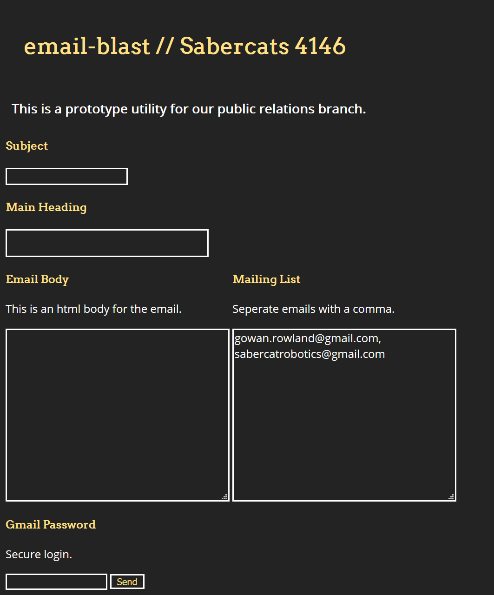
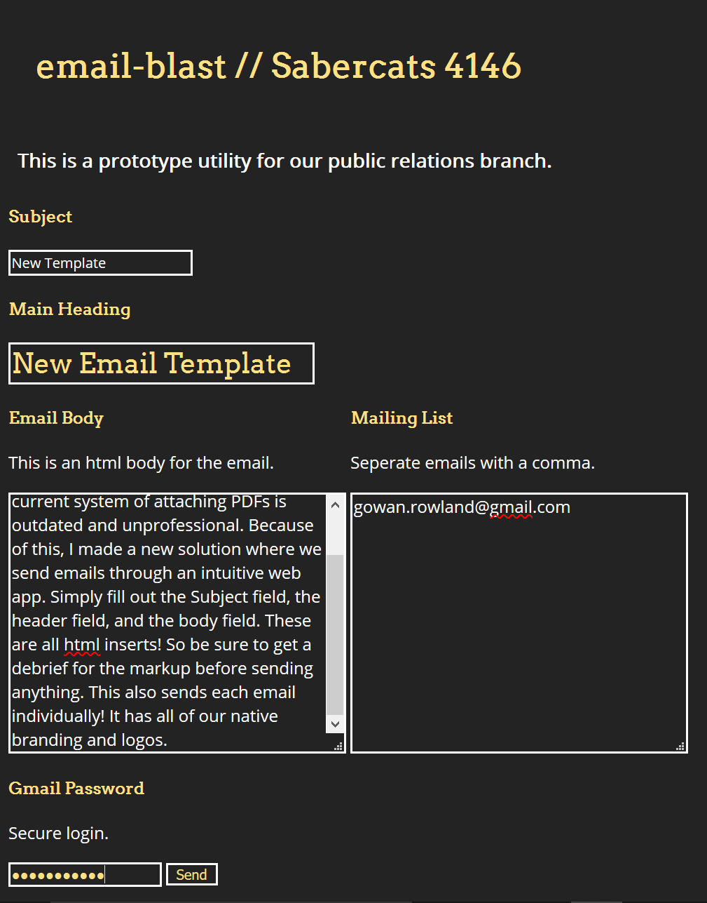
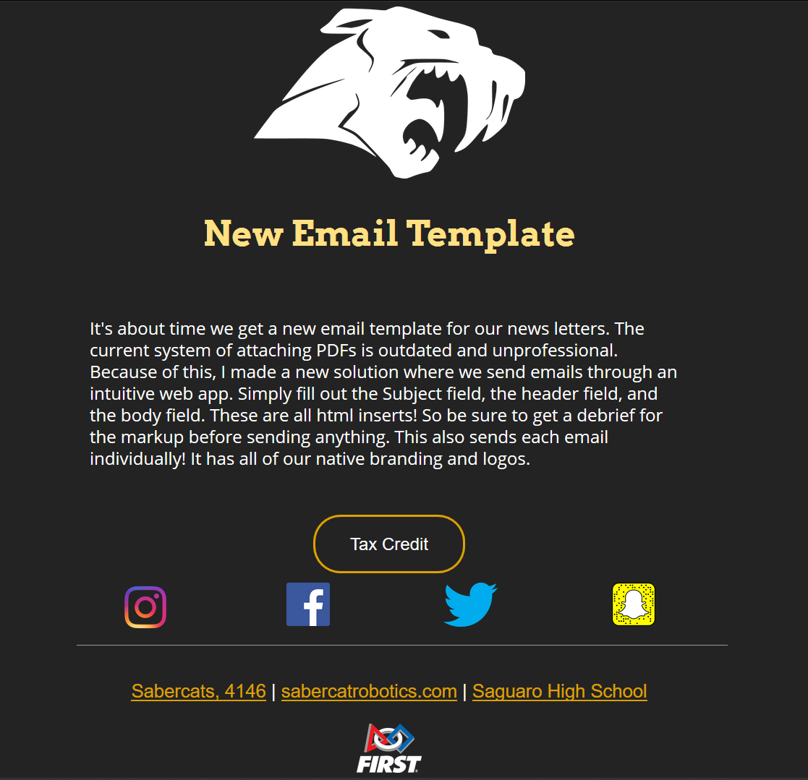

# email-blast // Sabercats 4146

We updated the email blast to be a web utility for PR to use! This is still in a very early stage prototype and we need public relation's feedback as much as possible. 

## How to use

The process is fairly straightforward. Here's what the web interface looks like:

#### 1) Fill out the Subject field

#### 2) Fill out the Heading field

#### 3) Wire the body of your email in Email Body text area.

Remember, you can use html tags inside the Email Body. Like the `` tag.

#### 4) Fill out the Mailing List form. Separate emails with commas.

#### 5) Enter the gmail password in the Gmail Password area. Press Send!

### Here's an example of the input and output.

This is a utility for sending email blasts for parents, volunteers, sponsors, or community.